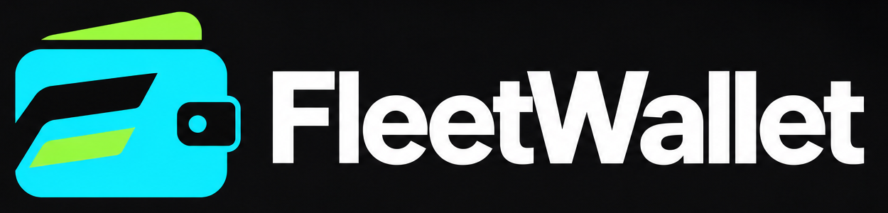

  

  <strong>多钱包管理 · 批量交易 · 批量转账</strong>

  <a href="https://github.com/zlccns/fleet-wallet-releases/releases">下载应用</a>
  · <a href="#主要功能">主要功能</a>
  · <a href="#开始使用">开始使用</a>
  · <a href="#数据与安全">数据与安全</a>

# FleetWallet

把多个钱包的日常操作，集中到一个桌面工作空间。

FleetWallet 面向需要管理多个 EVM 钱包的用户，支持资产查询、批量买卖代币、资金分发与归集。从选择钱包、检查执行条件到查看逐笔结果，在同一个应用中完成。

## 主要功能

| 功能       | 你可以做什么                                                           |
| ---------- | ---------------------------------------------------------------------- |
| 多钱包管理 | 导入钱包，使用备注、分组和标签整理账户，快速筛选与批量选择。           |
| 资产概览   | 查看原生币和代币余额，按需刷新，了解每项余额的更新时间。               |
| 批量交易   | 为选中的钱包买入或卖出代币，设置滑点和费用限制，执行前确认报价与金额。 |
| 批量转账   | 分发或归集原生币和代币，查看每笔操作的状态与交易哈希。                 |
| 执行记录   | 在操作页面跟踪进度，在历史记录中回看结果。                             |

同一钱包可用于不同 EVM 网络；资产和交易记录按网络分别展示。交易功能取决于当前网络已接入的交易协议及可用流动性。

## 下载

**[前往 Releases 下载 FleetWallet →](https://github.com/zlccns/fleet-wallet-releases/releases)**

| 平台  | 手动安装文件 | 架构                                                 |
| ----- | ------------ | ---------------------------------------------------- |
| macOS | `.dmg`       | 标有 `universal` 的包同时支持 Apple Silicon 和 Intel |

目前提供 macOS 构建，其他平台暂未提供正式安装包。请以对应版本的发布说明与附件为准；历史版本可能仍使用旧产品名称。

> 当前处于开发阶段，尚未完成 Apple 签名与公证以及覆盖更新验收。macOS 可能阻止打开安装包；请先阅读该版本的安装说明。

## 开始使用

1. 创建本地保险库，设置并妥善保存主密码。
2. 导入钱包，按需要设置备注、分组和标签。
3. 选择网络，刷新钱包资产余额。
4. 选择参与的钱包，配置交易或转账，并核对预检查结果。
5. 确认执行，在结果列表查看各钱包的状态。

## 数据与安全

**钱包秘密保存在本机加密保险库中。** 主密码用于解锁保险库，应用无法找回遗失的主密码。

钱包资料与操作历史保存在本地。余额查询和交易执行需要连接所选网络的 RPC 服务；本地存储不意味着离线完成链上操作。

执行前会检查相关条件并要求确认。链上状态可能在检查后变化，预检查通过不保证成交；结果以实际链上状态为准。

你可以导出加密保险库备份。该备份用于恢复保险库，不包含全部应用设置与交易历史。请妥善保管备份和密码，不要将私钥、助记词或备份上传到公开反馈中。

## 版本与更新

支持更新检查的版本会在启动时检查新版本，也可通过 **设置 → 版本与更新** 手动检查。下载更新后，应用验证更新包签名，再由你确认安装；交易或转账执行期间不能安装更新。

Release 中的 `.app.tar.gz`、`.sig` 和 `latest.json` 用于应用内更新，无需手动安装这些文件。各版本具体支持的功能以发布说明为准。

应用内更新读取最新正式版。标记为 **Pre-release** 的版本可从发布页面手动下载，但不会进入正式版自动更新渠道。

## 关于此仓库

此仓库提供 FleetWallet 的安装包、版本说明和应用内更新文件。源码在独立私有仓库维护。

反馈问题时，请注明应用版本、系统版本和复现步骤，并移除截图或日志中的敏感信息。

## 许可证

许可证见 [LICENSE](LICENSE)，第三方组件遵循各自许可证。

FleetWallet 是独立工具，与 Robinhood 无隶属或官方背书关系。
